# System wspomagania uczelnianego

---
• Kacper Bednarczuk, Indeks: 318685
• Jakub Dobrowolski, Indeks: 318759
• Mateusz Zawal, indeks: 312428

## Dziedzina problemu
Celem projektu jest stworzenie systemu, który ułatwi komunikację pomiędzy wykładowcami a studentami.

---
## Spis treści
1. Analiza wymagań
2. Projektowanie systemu
   - Diagram przypadków użycia
   - Diagramy aktywności
   - Diagram klas
   - Diagramy sekwencji
3. Implementacja
4. Testowanie
5. Załączniki

## 1. Analiza wymagań

### Wymagania funkcjonalne:

- Rejestracja i logowanie użytkownika
- Kontakt pomiędzy użytkownikami w formie poczty
- Tworzenie kursów przez wykładowców
- Zarządzanie uczestnikami kursu przez wykładowców
- Zarządzanie ocenami studentów przez wykładowców
- Dodawanie symbolicznych referencji do plików do kursu przez studentów i wykładowców (bez trwałego przechowywania zawartości plików, jedynie ich nazwy/ścieżki w pamięci operacyjnej podczas działania aplikacji)

## 2. Projektowanie systemu

### Diagram przypadków użycia

    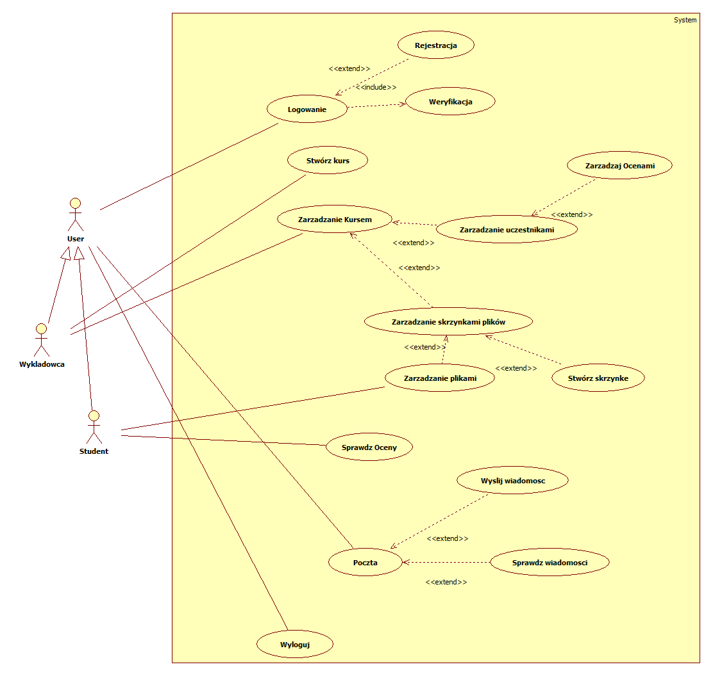

### Diagramy aktywności

	
Logowanie

    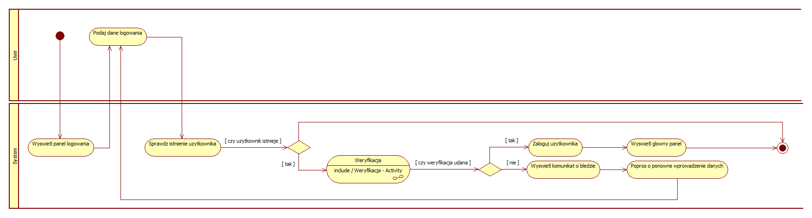

	
Rejestracja

    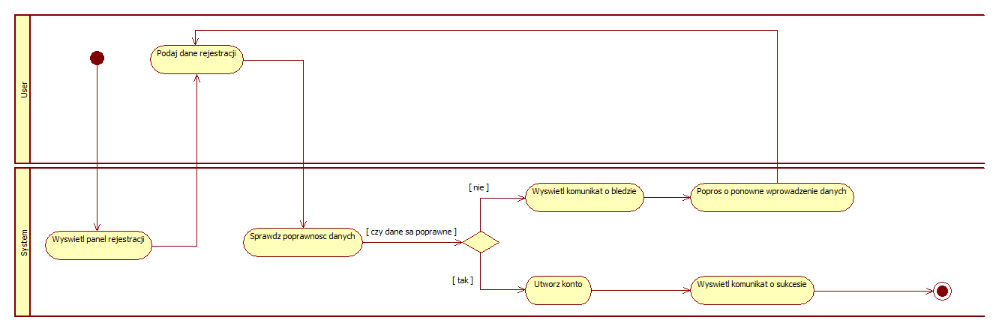

	
Weryfikacja

    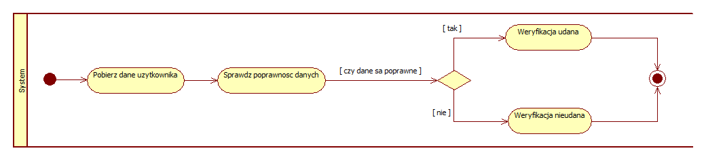

	
Zarządzanie kursem

    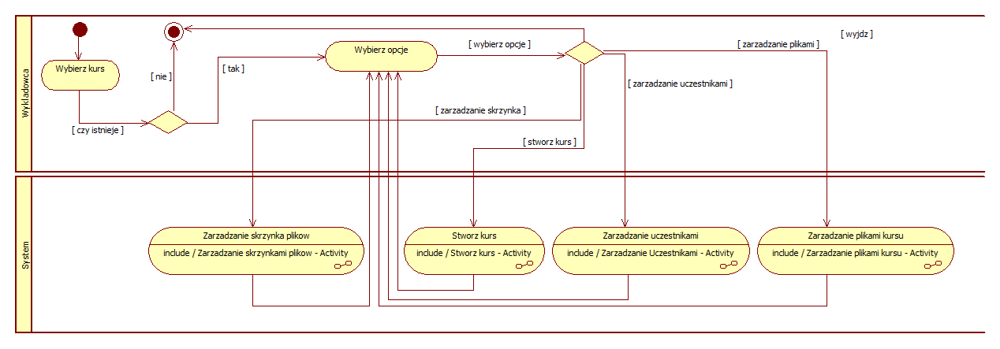

	
Zarządzanie uczestnikami

    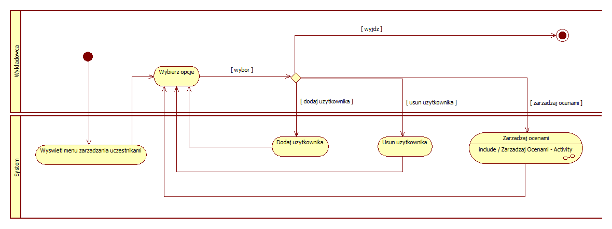

	
Zarządzaj ocenami

    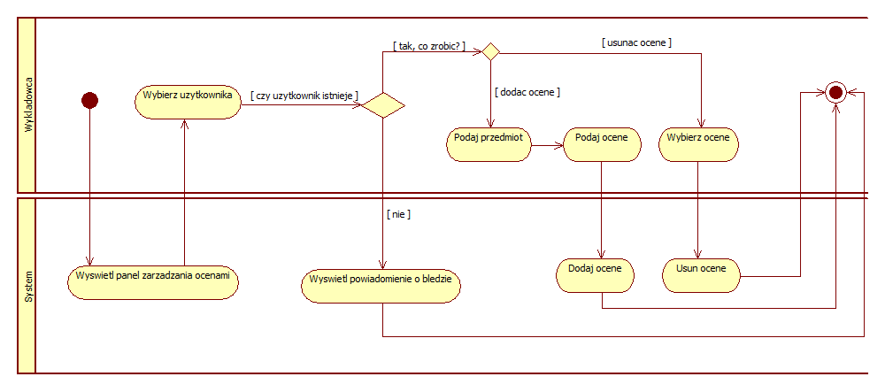

	
Zarządzanie skrzynkami plików

    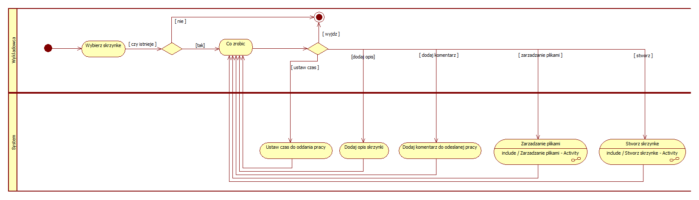

	
Zarządzanie plikami

    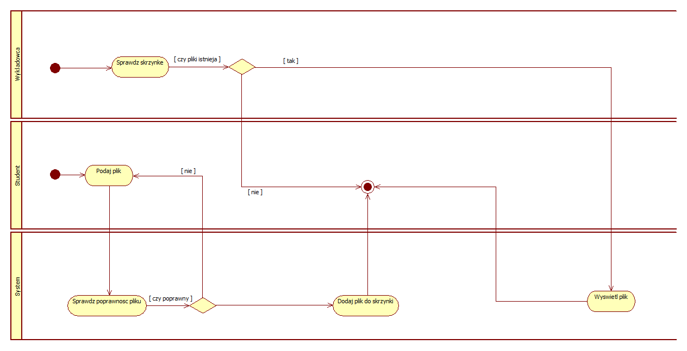

	
Stwórz skrzynkę

    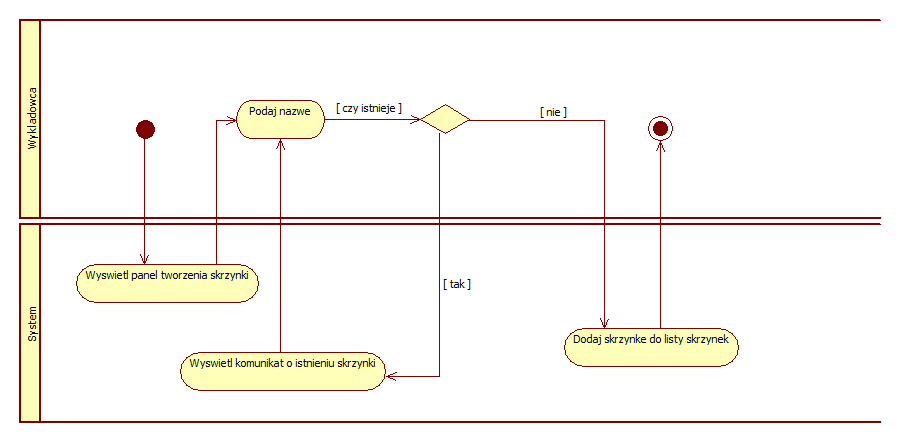

	
Sprawdź oceny

    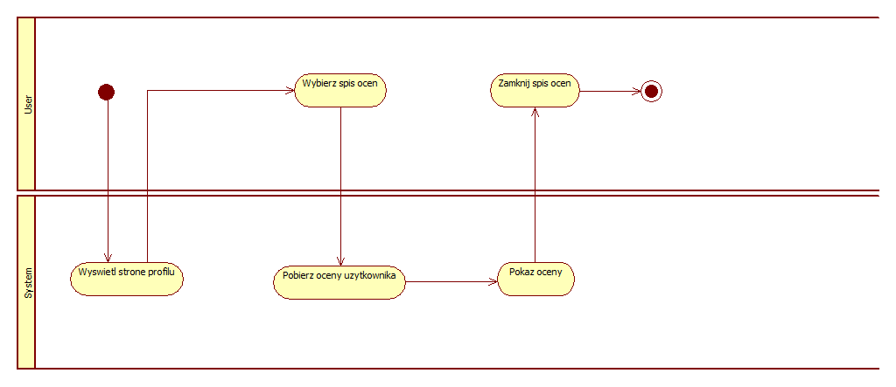

	
Poczta

    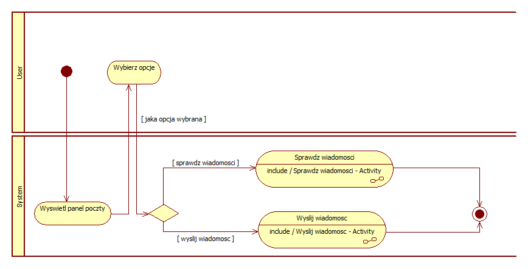

	
Wyślij wiadomość

    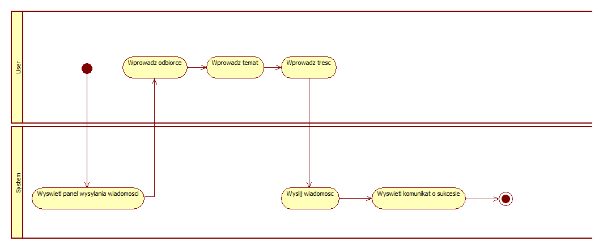

	
Sprawdź wiadomości

    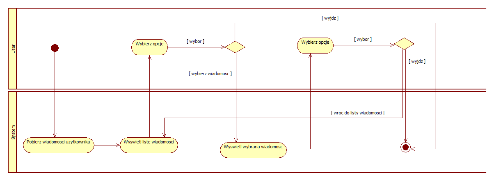

	
Wyloguj

    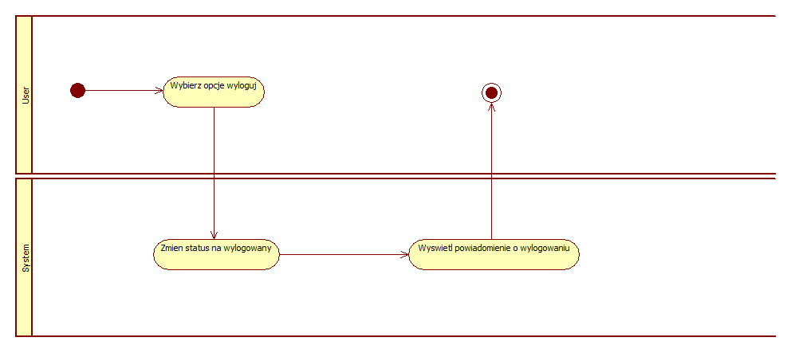

### Diagram klas

    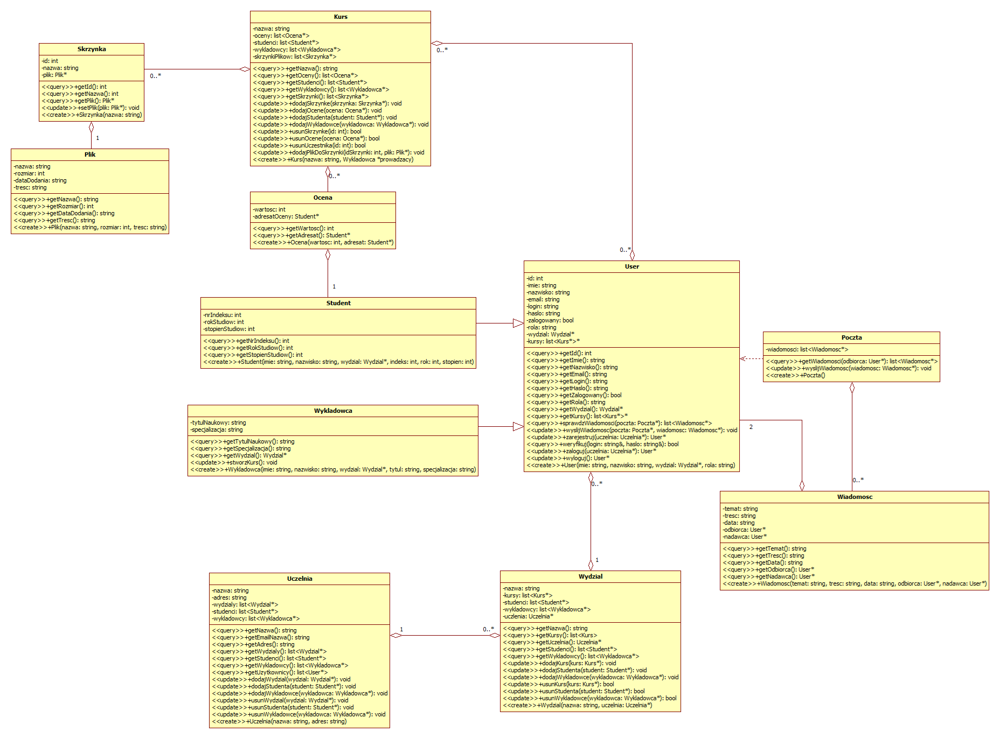

### Diagramy sekwencji

	
Kurs, cz. 1

    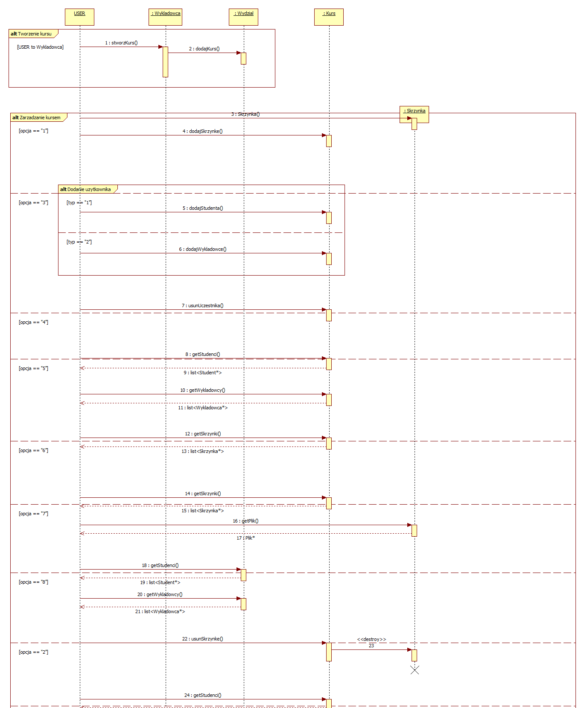

	
Kurs, cz. 2

    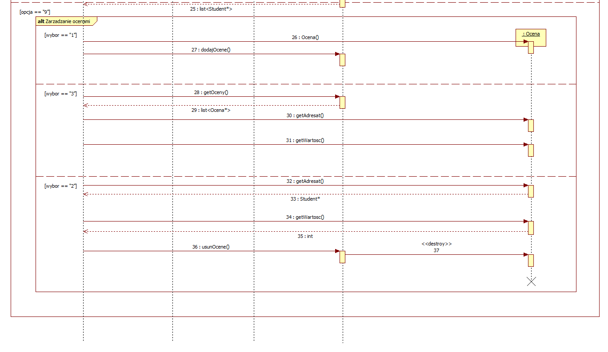

	
User

    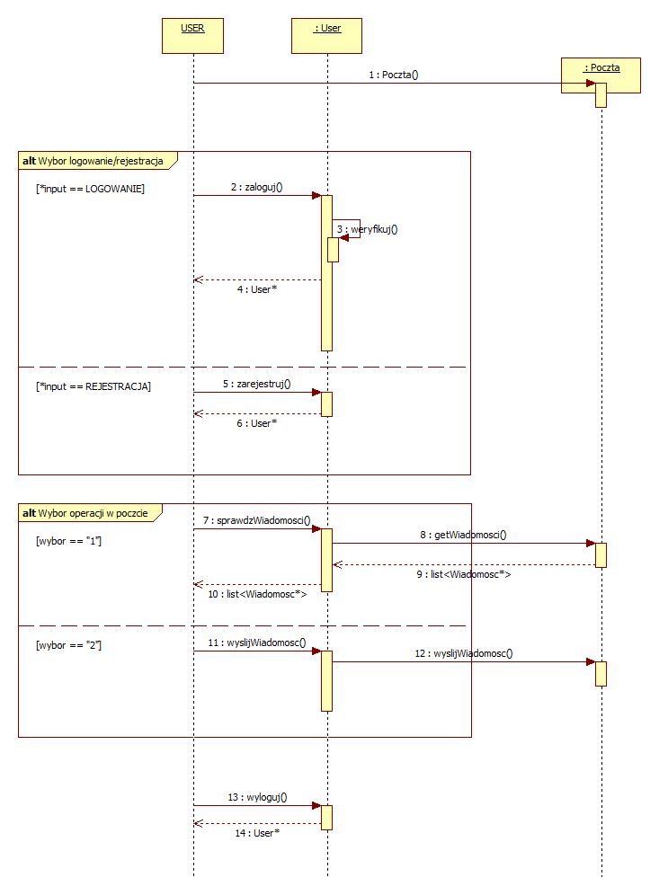

	
Dodanie pliku do skrzynki

    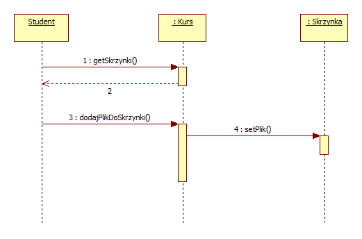

## 3. Implementacja

Implementacja systemu została zrealizowana w oparciu o język programowania C++, z ukierunkowaniem na działanie w środowisku wiersza poleceń (Command Line Interface - CLI). Wszystkie dane systemowe, takie jak informacje o użytkownikach, kursach, ocenach i wiadomościach, są przechowywane wyłącznie w pamięci operacyjnej podczas działania aplikacji i ulegają utracie po jej zakończeniu. Brak jest integracji z zewnętrznymi bazami danych czy bibliotekami graficznego interfejsu użytkownika.

Aplikacja została zaprojektowana w architekturze monolitycznej, z logicznym podziałem na kluczowe moduły funkcjonalne. Interakcja z użytkownikiem odbywa się w pełni poprzez konsolę.

- **Główna Pętla Aplikacji:** Odpowiedzialna za inicjalizację systemu, wyświetlanie głównego menu wyboru opcji dla użytkownika oraz zarządzanie przepływem programu w zależności od wyboru użytkownika.

- **Moduły Funkcjonalne:** Zestaw klas i funkcji implementujących logikę biznesową dla poszczególnych domen systemu:
    - **Moduł Użytkowników i Autoryzacji:** Zarządza operacjami takimi jak rejestracja, logowanie oraz weryfikacja uprawnień (rozróżnienie ról Student i Wykładowca). Dane użytkowników przechowywane są w strukturach danych w pamięci RAM.
    - **Moduł Zarządzania Kursami:** Umożliwia tworzenie, modyfikowanie i usuwanie kursów przez wykładowców oraz zarządzanie listami uczestników każdego kursu.
    - **Moduł Zarządzania Ocenami:** Oferuje funkcjonalności dla wykładowców do dodawania, edytowania i usuwania ocen studentów, a także umożliwia studentom przeglądanie swoich ocen.
    - **Moduł Poczty/Komunikacji:** Odpowiada za wewnętrzną komunikację pomiędzy użytkownikami systemu, umożliwiając wysyłanie i odbieranie wiadomości tekstowych.
    - **Moduł Zarządzania Plikami (w kontekście CLI):** Moduł ten symuluje zarządzanie plikami poprzez operowanie na ich nazwach lub ścieżkach jako ciągach znaków w pamięci. W kontekście CLI, "dodawanie plików" rozumiane jest jako przypisanie ich symbolicznej reprezentacji do kursu lub skrzynki plików, bez trwałego przechowywania zawartości plików na dysku.

- **Warstwa Interfejsu Konsolowego:** Komponenty odpowiedzialne za wyświetlanie menu, komunikatów systemowych i zapytań dla użytkownika (`std::cout`), a także za odczytywanie danych wejściowych z wiersza poleceń (`std::cin`).

## 4. Testowanie

Proces testowania aplikacji skupił się na weryfikacji poprawności logiki biznesowej zaimplementowanej w pamięci operacyjnej oraz na niezawodności interakcji poprzez interfejs wiersza poleceń.

- **Użyte testy:**
    
    - **Testy jednostkowe (Unit Tests):** Przeprowadzono testy izolowanych funkcji i metod klas (np. poprawność walidacji danych wejściowych, zgodność logiki biznesowej poszczególnych operacji).
    - **Testy integracyjne (Integration Tests):** Weryfikowano współpracę między różnymi modułami systemu działającymi w pamięci (np. czy pomyślna rejestracja użytkownika pozwala na jego późniejsze zalogowanie).
    - **Testy funkcjonalne (CLI Tests):** Sprawdzono pełne ścieżki użytkownika poprzez ręczne symulowanie interakcji z wierszem poleceń oraz, w miarę możliwości, automatyzację prostych scenariuszy wejścia/wyjścia w celu weryfikacji kompleksowych funkcjonalności systemu.
    - **Testy negatywne:** Obejmowały przypadki, w których użytkownik podawał nieprawidłowe dane, w celu weryfikacji poprawności obsługi błędów i wyświetlania adekwatnych komunikatów.

- **Przykłady przypadków testowych:**
    
    - **Rejestracja i logowanie:**
        - Rejestracja nowego użytkownika z unikalnymi danymi, a następnie pomyślne zalogowanie.
        - Próba logowania z nieprawidłowymi poświadczeniami (np. błędne hasło, nieistniejąca nazwa użytkownika).
    - **Tworzenie i zarządzanie kursem (Wykładowca):**
        - Pomyślne utworzenie nowego kursu przez zalogowanego wykładowcę.
        - Próba utworzenia kursu o nazwie już istniejącej.
        - Dodanie i usunięcie studenta z listy uczestników kursu.
    - **Zarządzanie ocenami (Wykładowca/Student):**
        - Dodanie oceny studentowi przez wykładowcę.
        - Usunięcie oceny studenta przez wykładowcę.
        - Sprawdzenie własnych ocen przez studenta.
    - **Poczta/Komunikacja:**
        - Wysłanie wiadomości do istniejącego użytkownika.
        - Sprawdzenie listy odebranych wiadomości.
        - Próba wysłania wiadomości do nieistniejącego odbiorcy.

- **Wyniki testów:** Zaimplementowane funkcjonalności działają poprawnie zgodnie ze specyfikacją. Wszystkie dane są poprawnie zarządzane w pamięci operacyjnej podczas trwania sesji aplikacji. Aplikacja spełnia podstawowe wymagania określone w analizie.

## 5. Załączniki

- **Repozytorium projektu:** [https://github.com/overstimulation/software-engineering-group-project](https://github.com/overstimulation/software-engineering-group-project)
- **Kod źródłowy:** Pełny kod źródłowy aplikacji w języku C++ dostępny jest pod wskazanym adresem repozytorium, w folderze "code"; https://github.com/overstimulation/software-engineering-group-project/tree/main/code
- **Przykładowe scenariusze użycia CLI:** W repozytorium, w folderze "documentation", dostępne są przykładowe sekwencje interakcji z aplikacją w konsoli (scenariusze), demonstrujące jej funkcjonalności; https://github.com/overstimulation/software-engineering-group-project/blob/main/documentation/scenariusze.md