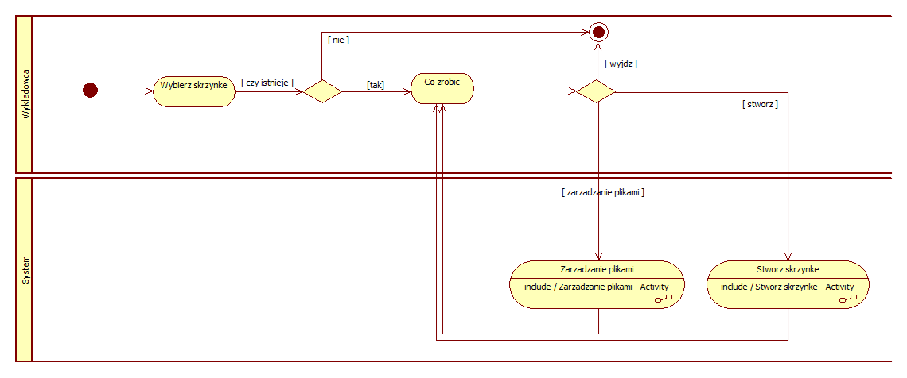

# System wspomagania uczelnianego

---
• Kacper Bednarczuk, Indeks: 318685
• Jakub Dobrowolski, Indeks: 318759
• Mateusz Zawal, indeks: 312428

## Dziedzina problemu
Celem projektu jest stworzenie systemu, który ułatwi komunikację pomiędzy wykładowcami a studentami.

---
## Spis treści
1. Analiza wymagań
2. Projektowanie systemu
   - Diagram przypadków użycia
   - Diagramy aktywności
   - Diagram klas
   - Diagramy sekwencji
3. Implementacja
4. Testowanie
5. Załączniki

## 1. Analiza wymagań

Wymagania funkcjonalne:  
• Rejestracja i logowanie użytkownika  
• Kontakt pomiędzy użytkownikami w formie poczty  
• Tworzenie kursów przez wykładowców  
• Zarządzanie uczestnikami kursu przez wykładowców  
• Zarządzanie ocenami studentów przez wykładowców  
• Dodawanie plików do kursu przez studentów I wykładowców

## 2. Projektowanie systemu

### Diagram przypadków użycia

    

### Diagramy aktywności

	
Logowanie

    

	
Rejestracja

    

	
Weryfikacja

    

	
Stwórz kurs

    

	
Zarządzanie kursem

    

	
Zarządzanie uczestnikami

    

	
Zarządzaj ocenami

    

	
Zarządzanie plikami kursu

    

	
Zarządzanie skrzynkami plików

    

	
Zarządzanie plikami

    

	
Stwórz skrzynkę

    

	
Sprawdź oceny

    

	
Poczta

    

	
Wyślij wiadomość

    

	
Sprawdź wiadomości

    

	
Wyloguj

    

### Diagram klas

    

### Diagramy sekwencji

	
Dodanie pliku do skrzynki

    

## 3. Implementacja

## 4. Testowanie

Użyte testy?  
Przykłady?
Wyniki testów?

## 5. Załączniki

Repozytorium: [https://github.com/overstimulation/software-engineering-group-project](https://github.com/overstimulation/software-engineering-group-project)